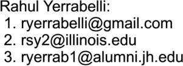

# App

## Installation

## File Structure
Standard file structure for python packages as follows:  
* `<main folder name>`
  * *docs/*  
    * **LICENSE.txt**
    * **README.md**         _<- .rst file type preferred in python, but .md is more common overall_
  * *src/*  <- dedicated src is not always done but recommended for compatibility
    * `<module name>`       _<- often the same name as the main folder, but should be a subfolder_
      * `__init__.py`       _<- an empty file can be all that's needed at times. However, importing items here can be useful as they will be accessible to any file that is importing the overall module_ 
      * `_version.py`       _<- autogenerated by versioneer using info from setup.cfg [^1]_
      * `main.py`
      * `utils.py`
      * `<any other python files>`
  * **versioneer.py**       <- _must be here in the top level folder [^1]_
  * **setup.py**            <- _must be here in the top level folder_ [^2]
  * **setup.cfg**           <- _must be here in the top level folder_ [^2] 
  * **requirements.txt**    <- _must be here in the top level folder_ [^3]
  * **MANIFEST.in**         <- _Not strictly required_

[^1]: Unlike `versioneer.py`, `_version.py` does not have to be on the top level folder, which I prefer so it does not clutter the project and can be more easily accessed in the project. setup.cfg should be changed so that the file path of the src/\<module\>, where `_version.py` will be kept is given
[^2]: Some applications use only one- a setup.py or setup.cfg, but versioneer prefers both.
[^3]: Can be autogenerated by PyCharm. Will not be blank as must have versioneer at least.

## References
1. https://github.com/yngvem/python-project-structure
1. https://github.com/johnthagen/python-blueprint#project-structure 

## Usage
Run `src/YerrabelliFlask/main.py` with python

## Tested OS and History Details  
* Tested primarily on Mac OS X (10.14 Mojave on a 2018 Macbook pro) with python 3.6-3.9 derived from anaconda on PyCharm.  

## License
See [LICENSE.txt](LICENSE.txt)

## Author & Contact info
Rahul Yerrabelli  
https://github.com/ryerrabelli/

